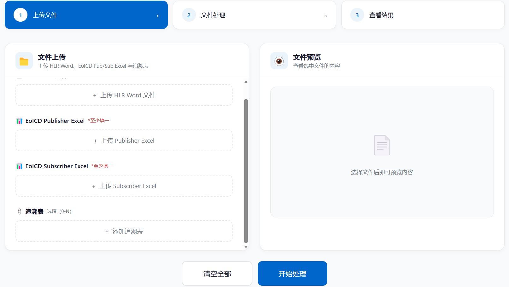
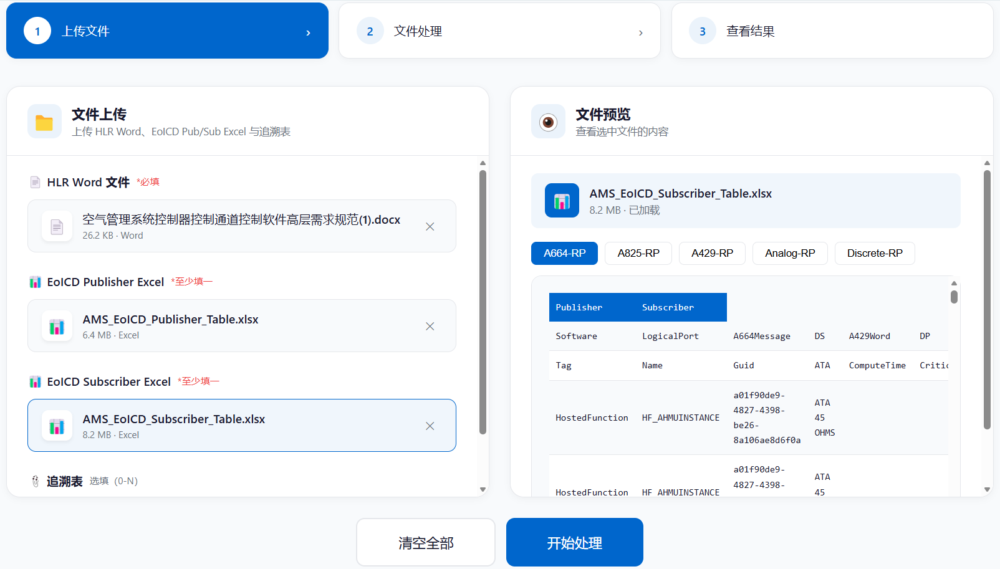
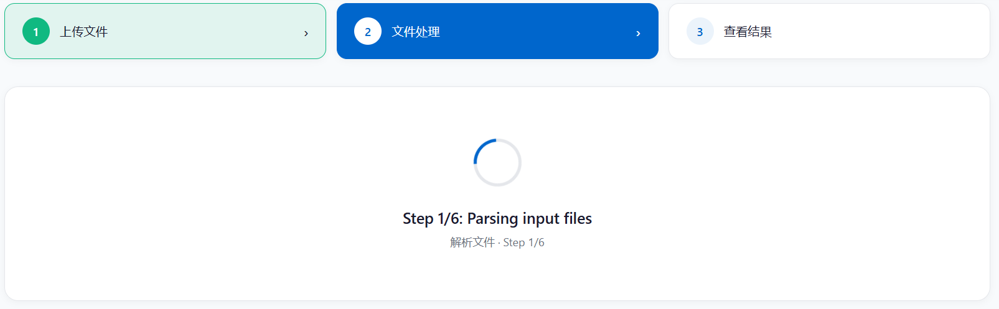
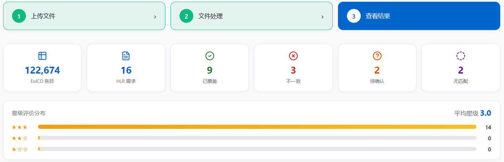
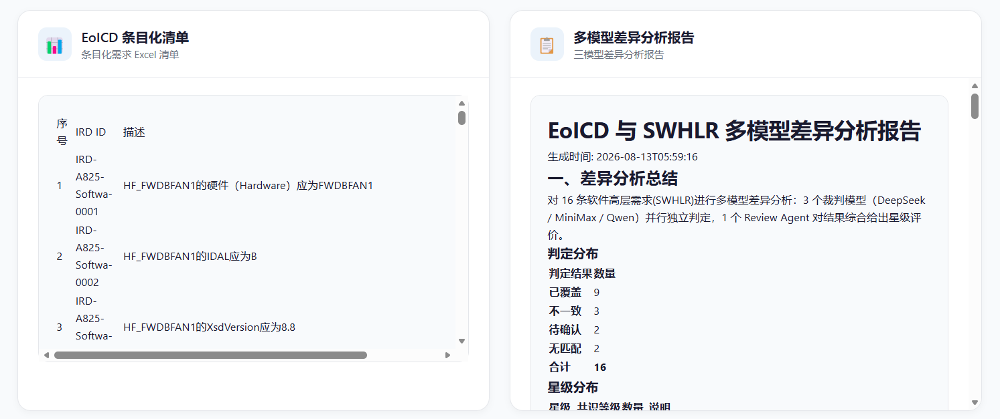

# ICD工具原型Ver2.0

ICD工具原型Ver2.0是一个面向EoICD源文件和软件高层需求（HLR）文件的智能化差异分析与需求生成工具。

当前运行版本为 **V4 反向管线**：从软件高层需求（HLR）出发，验证每条 HLR 需求是否能在 EoICD 接口定义中找到对应项（即 HLR 到 EoICD 的可追溯性），通过 DeepSeek / MiniMax / Qwen 三模型并行裁判 + Review Agent 共识复核，输出条目化清单和一致性分析报告。项目同时保留了 V3 正向管线代码，作为版本补充（详见 [§9 V3 正向管线（旧版保留）](#9-v3-正向管线旧版保留)）。

## 1. 主要功能

- **HLR→EoICD 可追溯性分析**：解析 HLR Word 和 EoICD PubSub Excel，通过 AI 标注 → 反向匹配 → 三模型裁判 → 共识复核，判断每条 HLR 需求在 EoICD 中是否有对应的接口定义。
- **智能裁判与共识评分**：DeepSeek / MiniMax / Qwen 三模型并行独立判定，Review Agent 综合复核并给出 1-3★ 星级评分。
- **追溯表预筛选**：支持上传设备→HLR / 设备→ICD 追溯表，预先缩小匹配范围，匹配失败时自动回退到全量匹配。
- **多维度报告输出**：输出条目化清单（.xlsx）和单模型/多模型一致性分析报告（.docx），含不一致属性栏等分析明细。

## 2. 输入输出

### 输入

| 文件 | 格式 | 说明 |
|------|------|------|
| HLR Word 文件 | .docx | **必填**，从"软件需求"章节提取需求条目 |
| EoICD Publisher Excel | .xlsx | 与 Subscriber 二选一，发送侧接口定义 |
| EoICD Subscriber Excel | .xlsx | 与 Publisher 二选一，接收侧接口定义 |
| 追溯 Excel | .xlsx | 选填（0-N 个），设备→HLR / 设备→ICD 追溯表 |

### 输出

| 输出文件 | 说明 |
|------|------|
| `EoICD条目化清单.xlsx` | 条目化需求 Excel 清单 |
| `EoICD与SWHLR单模型差异分析报告_DeepSeek.docx` | DeepSeek 一致性分析 |
| `EoICD与SWHLR单模型差异分析报告_MiniMax.docx` | MiniMax 一致性分析 |
| `EoICD与SWHLR单模型差异分析报告_Qwen.docx` | Qwen 一致性分析 |
| `EoICD与SWHLR多模型差异分析报告.docx` | 三模型共识分析（含星级评分） |

> V4 三模型并行裁判均支持真实 LLM 接入。DeepSeek API Key 为必填（同时用于 HLR 标注和 Review Agent），MiniMax / Qwen API Key 为可选（未配置时从 `JUDGE_PROVIDERS` 中移除对应模型即可）。`USE_MOCK_LLM=1` 模式下所有模型均走 mock。

## 3. 处理流程

```text
上传文件 → 解析输入 → HLR AI 标注 → 反向匹配（可选用追溯表预筛选）
         → 三模型并行裁判 → Review Agent 共识 → 输出报告
```

1. **解析输入**：解析 HLR Word + EoICD PubSub Excel → 结构化需求列表，同时生成条目化清单 Excel
2. **HLR AI 标注**：DeepSeek 对每条 HLR 标注 bus_types / labels / devices / signal_keywords
3. **反向匹配**：HLR → EoICD Block 级匹配（Label 前缀粗筛 → 6 维评分 → 三级分层），可选追溯表预筛选 + 兜底机制
4. **多模型裁判**：DeepSeek / MiniMax / Qwen 三模型并行独立判定
5. **Review Agent 共识**：综合复核并给出星级评价（1-3★）
6. **报告生成**：输出 1 份 xlsx + 4 份 docx

详细流程说明见 [`docs/project/workflow.md`](docs/project/workflow.md)。

## 4. 快速开始

### 4.1 环境要求

- Docker ≥ 24.0 + Docker Compose ≥ v2.26
- DeepSeek API Key（真实模式必填）
- MiniMax / Qwen API Key（可选，未配置时需从 `JUDGE_PROVIDERS` 中移除，否则报错）

### 4.2 配置

在项目根目录创建 `backend/.env`（直接复制 `backend/.env.example` 即可）：

```bash
# 默认 mock 模式，无需任何 API Key，开箱即用
USE_MOCK_LLM=1
```

如需接入真实 LLM，将 `USE_MOCK_LLM` 改为 `0` 并填写对应模型的 API Key：

```bash
USE_MOCK_LLM=0

# DeepSeek（必填）
DEEPSEEK_API_KEY=your_key

# MiniMax（可选，未配置时需从 JUDGE_PROVIDERS 中移除，否则报错）
MINIMAX_API_KEY=your_key

# Qwen（可选，未配置时从 JUDGE_PROVIDERS 中移除即可）
QWEN_API_KEY=your_key

# 裁判模型白名单（按实际填写的 Key 调整，如只填了 DeepSeek 则设为 deepseek）
JUDGE_PROVIDERS=deepseek,minimax,qwen
```

> **注意**：`JUDGE_PROVIDERS` 中列出的每个模型都必须有对应的 API Key，否则会报错。如果只配置了 DeepSeek Key，请将此项设为 `deepseek`。

### 4.3 启动
在项目根目录中启动
```bash
docker compose up -d --build
```

### 4.4 访问

| 地址 | 说明 |
|------|------|
| `http://localhost:3000` | 前端界面 |
| `http://localhost:8000/api/health` | 后端健康检查 |
| `http://localhost:8000/api/v4/health` | V4 健康检查 |

### 4.5 使用演示

启动完成后，打开 `http://localhost:3000`，按以下步骤操作。

#### 步骤 1：打开前端界面

页面顶部为三步工作流导航（上传文件 → 文件处理 → 查看结果），右上角显示后端服务连接状态。


#### 步骤 2：上传文件

在"文件上传"卡片中，按需上传三类文件：

| 文件 | 必填性 | 说明 |
|------|------|------|
| HLR Word 文件 | 必填 | 软件高层需求 Word（.docx） |
| EoICD Publisher Excel | 与 Subscriber 至少填一 | 发送侧接口定义（.xlsx/.xls） |
| EoICD Subscriber Excel | 与 Publisher 至少填一 | 接收侧接口定义（.xlsx/.xls） |
| 追溯表 | 选填（0-N 个） | 设备→HLR / 设备→ICD 追溯表，可多选 |

点击文件条目可在右侧"文件预览"卡片查看内容；点击文件旁的 ✕ 可移除已选文件。


#### 步骤 3：开始处理

点击底部"开始处理"按钮。若未上传 HLR Word 文件，或 Publisher/Subscriber 均未填写，前端会弹窗提示。进入"文件处理"页面，显示六步进度（解析文件 → HLR标注 → 反向匹配 → 多模型裁判 → 共识复核 → 报告生成）及当前处理的 Case 计数。


#### 步骤 5：查看结果与下载

处理完成后自动进入"查看结果"页面，包含三部分：

1. **统计卡片与星级评价分布**：EoICD 条目数、HLR 需求数，以及已覆盖 / 不一致 / 待确认 / 无匹配的数量分布，1-3★ 星级分布与平均星级。

2. **EoICD 条目化清单与多模型差异分析报告预览**：展示条目化需求 Excel 清单和三模型差异分析报告的预览

3. **下载输出文档**：点击下方下载卡片即可下载对应产物（条目化清单 XLSX、三份单模型分析报告、多模型共识报告）。


处理完成后如需再次分析，点击"处理新文件"按钮即可回到上传界面重新开始。

## 5. 工程结构

```text
icd-tool-prototype/
├── frontend/                     # 前端工程
│   ├── src/                      #   源代码
│   │   ├── api/                  #     后端 API 调用封装
│   │   ├── components/           #     页面组件
│   │   ├── App.tsx               #     应用入口
│   │   └── types.ts              #     TypeScript 类型定义
│   ├── Dockerfile
│   └── package.json
├── backend/                      # 后端工程
│   ├── app/
│   │   ├── api/v3/               # V3 API 路由（旧版保留）
│   │   ├── api/v4/               # V4 API 路由（router / schemas / runner / coverage / jobs / outputs）
│   │   ├── crew/                 # V3 CrewAI 多智能体编排（旧版保留）
│   │   ├── merge/                # V3 跨 chunk 合并（旧版保留）
│   │   ├── scoring/              # V3 Python 硬规则评分（旧版保留）
│   │   ├── docx/                 # V3 Word 文档生成（旧版保留）
│   │   ├── parsers/              # V3 输入文件解析（旧版保留）
│   │   ├── llm/                  # V3 LLM 工厂 + Mock（旧版保留）
│   │   ├── prompts/              # V3 Prompt 文本资产（旧版保留）
│   │   ├── skills/               # V3 Skill 文本资产（旧版保留）
│   │   ├── v4/                   # V4 业务模块（反向管线）
│   │   │   ├── comparison/       #   多模型裁判 + Review Agent 共识 + 报告生成
│   │   │   ├── matching/         #   反向匹配（HLR 标注、信号画像、Block 聚合、HLR 分类）
│   │   │   ├── llm/              #   LLM 抽象层（DeepSeek / MiniMax / Qwen Client + Mock）
│   │   │   ├── doc_generators/   #   xlsx + 单模型 docx + 共识 docx 生成
│   │   │   ├── parsers/          #   EoICD PubSub Excel + HLR Word 解析
│   │   │   ├── traceability/     #   追溯表预筛选
│   │   │   └── prompts/          #   V4 Prompt 文本资产
│   │   ├── job_manager.py        # 共享任务状态管理（V3/V4 共用，kind 字段区分）
│   │   ├── models.py             # V3 Pydantic 数据模型（旧版保留）
│   │   ├── pipeline.py           # V3 主流程编排（旧版保留）
│   │   └── main.py               # FastAPI 入口（thin shell，仅 CORS + 路由装载）
│   ├── output/                   # 运行时输出文件（v3/{job_id}/ + v4/{job_id}/）
│   ├── Dockerfile
│   ├── requirements.txt
│   └── .env.example
├── docs/                         # 正式工程文档
│   ├── project/                  #   项目范围与流程说明
│   ├── architecture/             #   架构与 API 设计
│   ├── development/              #   开发纪要与问题记录
│   └── decisions/                #   重大技术决策（ADR）
├── .github/                      # GitHub Issue 模板与 PR 模板
├── .claude/                      # Claude Code 规则
├── docker-compose.yml
├── CLAUDE.md
├── CHANGELOG.md
└── README.md
```

详细架构说明见 [`docs/architecture/current-architecture.md`](docs/architecture/current-architecture.md)。

## 6. 文档索引

| 文档 | 说明 |
|------|------|
| `CLAUDE.md` | Claude Code 工作入口和项目规则 |
| `docs/project/scope.md` | 项目范围、输入输出边界、V4 能力说明 |
| `docs/project/workflow.md` | 业务流程、各阶段输入输出 |
| `docs/architecture/current-architecture.md` | 软件架构、模块职责、V3/V4 双版本共存 |
| `docs/architecture/api.md` | API 接口定义 |
| `docs/decisions/ADR-001-V4后端接入策略.md` | V4 后端工程化集成关键决策 |
| `docs/development/development-log.md` | 开发纪要 |
| `docs/development/debug-log.md` | 问题排查记录 |
| `.claude/rules/context-rules.md` | Claude Code 上下文读取规则 |
| `.claude/rules/debug-rules.md` | Claude Code 调试规则 |
| `.claude/rules/documentation-rules.md` | Claude Code 文档更新规则 |

## 7. 技术栈

| 层级 | 技术 |
|------|------|
| 前端 | React、TypeScript、mammoth、xlsx、lucide-react |
| 后端框架 | Python、FastAPI、Pydantic |
| 文件处理 | openpyxl、python-docx、PyYAML、python-dotenv |
| AI/LLM | DeepSeek、MiniMax、Qwen / DashScope、CrewAI、LiteLLM |
| 部署 | Docker Compose |

## 8. 当前阶段

工程处于 ICD 工具 2.0 端到端原型验证阶段。

- **V4 反向管线**：已完成 HLR→EoICD 可追溯性分析全流程（6 步），三模型并行裁判 + 星级评分共识，输出 5 份产物。DeepSeek 为必填（同时用于 HLR 标注和 Review Agent），MiniMax / Qwen 为可选（未配置时从 `JUDGE_PROVIDERS` 中移除即可）。
- **前端**：默认使用 V4 反向管线界面。
- **V3 旧版代码**：后端路由和业务模块保留在项目中，前端不调用（详见 [§9](#9-v3-正向管线旧版保留)）。

## 9. V3 正向管线（旧版保留）

V3 正向管线是本项目的早期版本，于 V4 开发完成后作为旧版保留。V3 代码全部保留在项目中（后端路由通过 `/api` 命名空间注册），但当前前端不调用。按照 ADR-001 规划，V3 将在 V4 稳定后另开 Issue 评估下线。

### 功能概述

V3 正向管线从 EoICD 出发，根据用户输入的 EoICD 源文件（Word + PubSub Excel）和软件高层需求文件，通过 MiniMax 和 DeepSeek 双模型 CrewAI 多智能体生成条目化需求候选结果并评分择优，再将最优条目化需求与软件高层需求进行差异比对，最终输出条目化需求文档和差异分析报告。

### 输入

| 文件 | 格式 | 说明 |
|------|------|------|
| EoICD Word 主文件 | .docx | 接口说明、数据定义等 |
| EoICD PubSub Excel 附件 | .xlsx | 一个或多个，接口信号表格 |
| 软件高层需求文件 | .docx | 优先支持 Word |

### 输出

| 输出文件 | 说明 |
|------|------|
| `MiniMax条目化需求.docx` | MiniMax 全量候选合并 |
| `DeepSeek条目化需求.docx` | DeepSeek 全量候选合并 |
| `EoICD条目化需求.docx` | 评分择优后的最佳条目化需求（下载文件名为 EoICD条目化需求.docx） |
| `EoICD与软件高层需求差异报告.docx` | 差异比对报告 |

### 处理流程

```text
上传文件 → 解析输入 → 双模型生成候选 → 评分择优 → 差异比对 → 输出文档
```

### API 入口

V3 通过 `/api` 命名空间注册，与 V4 的 `/api/v4` 隔离。跨版本查询（如用 V3 路由查 V4 任务）返回 404。

| 端点 | 方法 | 说明 |
|------|------|------|
| `/api/eoicd/analyze` | POST | 创建分析任务 |
| `/api/jobs/{id}` | GET | 查询任务状态 |
| `/api/jobs/{id}/result` | GET | 查询任务结果摘要 |
| `/api/jobs/{id}/outputs/requirements` | GET | 下载最优条目化需求 |
| `/api/jobs/{id}/outputs/minimax-requirements` | GET | 下载 MiniMax 条目化需求 |
| `/api/jobs/{id}/outputs/deepseek-requirements` | GET | 下载 DeepSeek 条目化需求 |
| `/api/jobs/{id}/outputs/difference-report` | GET | 下载差异报告 |

## 10. 开发约定

本项目采用 GitHub Repo + GitHub Projects + Claude Code 的轻量化敏捷开发方式。

### 10.1 基本原则

1. `main` 分支保持稳定；
2. 每个明确任务通过 Issue 跟踪；
3. 重要功能开发使用独立分支；
4. 大功能开发前先形成计划；
5. Debug 任务先定位问题，再进行最小修改；
6. 工程事实源以 `CLAUDE.md` 和 `docs/` 下文档为准；
7. Claude Code 不得主动创建分支、push、创建/合并 PR、关闭 Issue 或修改 Project 看板状态（由用户手动完成）。

### 10.2 分支命名约定

推荐分支命名格式如下：

```text
类型/issue编号-任务简述
```

常用类型包括：

```text
docs/      文档任务
feature/   功能开发
fix/       问题修复
chore/     工程杂项
refactor/  重构
```

示例：

```text
docs/issue-2-project-docs
feature/issue-3-minimal-skeleton
feature/issue-4-end-to-end-prototype
fix/issue-12-upload-error
```

### 10.3 Issue 与 PR 关联

PR 描述中可以使用以下语法关联或关闭 Issue：

```text
Closes #2
Related to #3
Part of #4
```

使用规则：

1. 当该 PR 完整满足某个 Issue 的验收标准时，可以使用 `Closes #编号`；
2. 当该 PR 只与某个 Issue 相关，但尚未完成验收时，应使用 `Related to #编号`；
3. 当该 PR 只完成某个 Issue 的一部分时，应使用 `Part of #编号`；
4. 不得关闭尚未验收通过的 Issue。